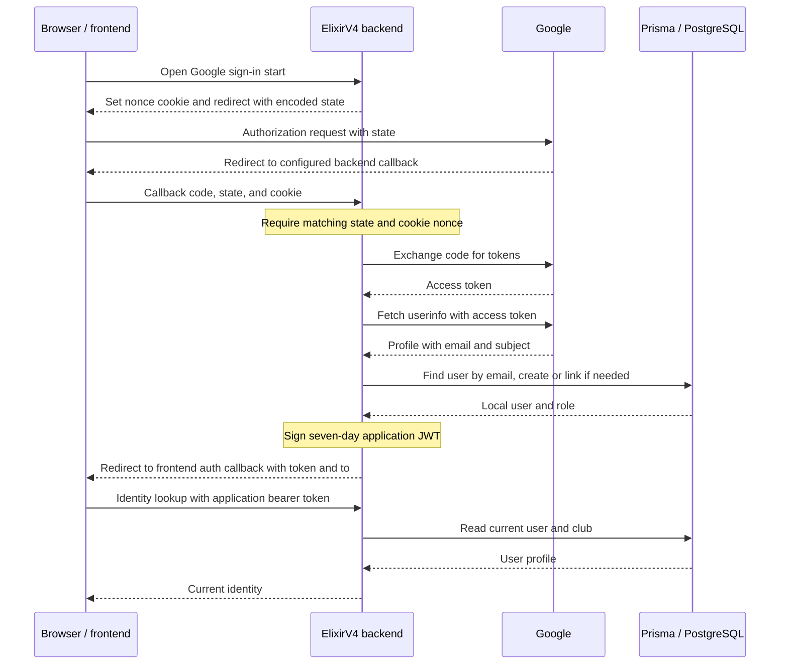

**Authentication** establishes who made a request. ElixirV4 signs application JWTs after password or Google sign-in and verifies them on protected requests. **Authorization** decides what that identity may do, through role middleware and controller-level checks against persisted resources.

These boundaries live in both routes and controllers. Frontend role-dependent navigation does not enforce backend permissions. The [Authentication API](../api-reference/authentication.mdx) is a placeholder for later route-level documentation.

## Supported identity flows

| Flow | Implemented behavior |
| --- | --- |
| Email/password registration | Validates input, creates a `STUDENT`, and returns an application JWT. |
| Email/password login | Looks up the email, verifies the password, and returns a JWT. |
| Google ID-token authentication | Accepts an ID token in a POST body, verifies it with Google, links or creates a user, and returns a JWT. |
| Google browser OAuth | Redirects the browser to Google, handles the authorization-code callback, and redirects to the frontend with a JWT. |
| Authenticated identity lookup | `/auth/me` verifies the JWT, then loads the current user and club from PostgreSQL. It does not issue a replacement token. |

<SourceReference href="https://github.com/vaibhavxtripathi/ElixirV4/blob/main/backend/src/routes/auth.ts">backend/src/routes/auth.ts</SourceReference>

## Password authentication

Registration uses a Zod schema for email, a password of at least eight characters, and nonempty first/last names. The controller checks required values and whether the email already exists, hashes the password with `bcryptjs` using a cost of 10, and creates the user. It explicitly sets `STUDENT`; a caller cannot select a privileged role through registration.

Login validates email/password input, loads the user by email, and compares the supplied password with the stored value using `bcrypt.compare`. A missing user or a failed comparison returns an invalid-credentials response. Both successful registration and login pass the user's identifier, email, and role to the same JWT utility.

Google-created users satisfy the required password column with the literal placeholder `google-oauth`, not a bcrypt hash. Google sign-in does not set a usable password through these flows, and the backend has no password-setup/reset route.

<SourceReference href="https://github.com/vaibhavxtripathi/ElixirV4/blob/main/backend/src/validators/auth.ts">backend/src/validators/auth.ts</SourceReference>
<SourceReference href="https://github.com/vaibhavxtripathi/ElixirV4/blob/main/backend/src/controllers/authController.ts">backend/src/controllers/authController.ts</SourceReference>

## JWT identity

`generateToken` signs claims named `userId`, `email`, and `role` with `JWT_SECRET`, with an expiration of **seven days**. `jsonwebtoken` adds its issuance/expiration timestamps. `verifyToken` verifies the signature and expiration using the same secret.

Clients send `Authorization: Bearer <token>`. The shared authentication middleware extracts the second space-separated header element; it does not explicitly require the first element to be `Bearer`. Missing tokens and verification failures return HTTP 401. Successful verification places the decoded payload on `req.user` and continues without a database lookup.

`/auth/me` then loads the current database user and rejects an identity whose user record no longer exists. This extra lookup is specific to that controller; it is not a global account-existence or current-role check.

<TechnicalDebt>
Role authorization reads the role embedded in an issued JWT. Changing `User.role` does not invalidate or update that token, so middleware can continue using the old role until the token expires. No application JWT refresh, revocation list, or server-side logout invalidation is implemented. Contributors must distinguish token claims from current database state when changing protected behavior.
</TechnicalDebt>

<SourceReference href="https://github.com/vaibhavxtripathi/ElixirV4/blob/main/backend/src/utils/jwt.ts">backend/src/utils/jwt.ts</SourceReference>
<SourceReference href="https://github.com/vaibhavxtripathi/ElixirV4/blob/main/backend/src/middleware/auth.ts">backend/src/middleware/auth.ts</SourceReference>

## Roles and ownership

The persisted roles are `STUDENT`, `CLUB_HEAD`, and `ADMIN`. `STUDENT` is the default for new accounts. Routes use `requireRole` to allow an explicit list of JWT roles; there is no automatic role hierarchy. For example, event creation allows only `CLUB_HEAD`, while event updates allow `ADMIN` and `CLUB_HEAD`. The users router requires `ADMIN` throughout.

Role access does not establish ownership. Event update, deletion, and registration-list controllers load the event and, for a `CLUB_HEAD` claim, load that user's current club and compare it with `Event.clubId`. An `ADMIN` claim bypasses that club comparison. Event creation similarly uses the user's current club after the route's role check.

These event checks use `User.clubId`, not `Club.clubHeadId`. Read [Data Model](./data-model.mdx#club-leadership-and-membership) before assuming the role, membership, and leadership fields form a synchronized invariant.

There are also controller-local identity checks outside the shared middleware: published blog detail is public, while an unpublished blog requires a verified bearer JWT belonging to an admin or its author. The blog controller verifies that token itself. Trace both layers when changing access, as described in [Backend Architecture](./backend-architecture.mdx).

<SourceReference href="https://github.com/vaibhavxtripathi/ElixirV4/blob/main/backend/src/routes/events.ts">backend/src/routes/events.ts</SourceReference>
<SourceReference href="https://github.com/vaibhavxtripathi/ElixirV4/blob/main/backend/src/controllers/eventController.ts">backend/src/controllers/eventController.ts</SourceReference>
<SourceReference href="https://github.com/vaibhavxtripathi/ElixirV4/blob/main/backend/src/controllers/blogController.ts">backend/src/controllers/blogController.ts</SourceReference>

## Google ID-token authentication

The POST flow reads `idToken` from the request body. It requires `GOOGLE_CLIENT_ID` and calls `OAuth2Client.verifyIdToken` with that client ID as the expected audience. It requires an email in the verified payload, then uses that email to find a local user.

If no user exists, it creates a `STUDENT` with profile names, avatar, and Google subject in `googleId`. If the existing user has no `googleId`, it attaches the subject and fills an absent avatar. An already-linked user's profile is not refreshed by this branch. The controller issues an ElixirV4 JWT with the local user's role; the Google token is not used as the backend's application bearer token.

This flow has no browser redirect or OAuth state cookie. It is separate from the browser authorization-code flow below.

## Google browser OAuth

The start controller requires the Google client ID, client secret, and callback URI. The URI uses `GOOGLE_REDIRECT_URI`, then `GOOGLE_REDIRECT_URL`. Frontend destination configuration has a separate fallback chain explained in [Deployment & Configuration](./deployment-configuration.mdx#oauth-destinations).

At `/auth/google/start`, the backend generates a random nonce and puts it in an `oauth_state_nonce` cookie for 600 seconds. The cookie uses `Path=/` and `SameSite=Lax`, plus `Secure` in production. It is not marked `HttpOnly`. State is base64url-encoded JSON containing the nonce (`n`), the requested post-login destination (`r`, default `/`), and a selected frontend origin (`o`). The nonce is used to compare state with the browser cookie; it is not sent as an OpenID Connect `nonce` parameter.

The backend redirects to Google's authorization URL with `openid`, `email`, and `profile` scopes, consent prompting, and offline access requested. On callback it requires `code` and `state`, decodes state, and checks the nonce against the cookie before exchanging the code for Google tokens. It uses the access token to fetch Google's userinfo profile, then performs the same email-based local user lookup/link/create pattern as the ID-token flow.

The diagram shows the successful code path, not a verified deployed URL. The callback chooses the frontend origin from state, falling back to configuration, and redirects to `/auth/callback?token=…&to=…`. The checked-in frontend stores the JWT in local storage and calls `/auth/me`; its API interceptor supplies the bearer header. After a successful lookup it selects a dashboard by current role; on lookup failure it uses `to`.

Google tokens are used within the callback and are not persisted by this implementation. Requesting offline access does not implement application JWT refresh. The callback does not clear the nonce cookie after success.

<TechnicalDebt>
The browser flow compares the state nonce with a cookie, but state's frontend origin and destination are not signed or validated by the callback beyond checking for a nonempty frontend URL. The application JWT is then placed in a redirect query string. Contributors must not treat nonce comparison as validation of every state field or assume the token is delivered through an authentication cookie.
</TechnicalDebt>

<SourceReference href="https://github.com/vaibhavxtripathi/ElixirV4/blob/main/backend/src/controllers/authController.ts">backend/src/controllers/authController.ts</SourceReference>
<SourceReference href="https://github.com/vaibhavxtripathi/ElixirV4/blob/main/src/app/auth/callback/page.tsx">src/app/auth/callback/page.tsx</SourceReference>
<SourceReference href="https://github.com/vaibhavxtripathi/ElixirV4/blob/main/src/lib/api.ts">src/lib/api.ts</SourceReference>
