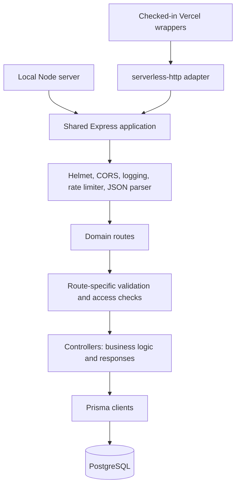

The backend is a separate Node.js application under `backend/`. TypeScript controllers expose community data and account operations through Express 5, use Prisma to access PostgreSQL, and return HTTP responses directly. The Next.js frontend is an API consumer, not part of the backend request pipeline.

Zod validates selected routes. JWT middleware authenticates protected requests, role middleware limits selected operations, and controllers perform resource-specific checks. There is no separate service or repository layer between controllers and Prisma.

## Execution boundaries

`src/server.ts` imports the shared Express application, connects the shared Prisma client, then starts listening on `PORT` or `3001`. A failed initial database connection logs an error and exits. Its `SIGTERM` listener disconnects that shared client before exiting.

`src/app.ts` constructs and exports the Express application without opening a listening socket. It owns global middleware, health/test responses, and domain route mounts.

The checked-in `api/index.ts` and `api/[...all].ts` wrappers import the same application and pass it to `serverless-http`. They modify the incoming URL and invoke the adapter; they do not run `server.ts` or its initial connection/shutdown lifecycle. Their presence establishes a serverless code path, not a verified public deployment contract. See [Deployment & Configuration](./deployment-configuration.mdx#production-routing).

The diagram shows the code path into Express. The wrappers' public routing remains unverified. Route checks vary by endpoint, and middleware can return early; some controllers also verify identity or ownership. Health/test responses do not use Prisma.

<SourceReference href="https://github.com/vaibhavxtripathi/ElixirV4/blob/main/backend/src/server.ts">backend/src/server.ts</SourceReference>
<SourceReference href="https://github.com/vaibhavxtripathi/ElixirV4/blob/main/backend/api/%5B...all%5D.ts">backend/api/[...all].ts</SourceReference>

## Request lifecycle

The application trusts one proxy hop with `trust proxy = 1`. Global middleware runs in this order:

1. **Helmet** adds security response headers.
2. **Custom CORS middleware** adds headers for allowed origins. Every `OPTIONS` request ends here with HTTP 200; only matching origins receive permission headers.
3. **Morgan** logs requests using `combined` in production and `dev` otherwise.
4. **Rate limiting** applies a 1,000-request ceiling per key over 15 minutes, with a JSON message for rejected requests.
5. **Express JSON parsing** populates `req.body` before route matching.

Express then matches a direct application route or a mounted domain router. That router composes validation, authentication, role checks, and its controller in the order written in the route definition. For example, event creation authenticates the token, requires `CLUB_HEAD`, validates input, then calls the controller. Registration and password login validate without requiring a token.

The controller performs business rules and any additional access checks, queries Prisma where needed, and builds the response. A middleware rejection stops execution before the controller; a successful database operation returns through the controller's response code.

<TechnicalDebt>
The limiter decodes a bearer token's payload without verifying its signature and uses a supplied `userId` as the bucket key. Otherwise it calls `ipKeyGenerator(req)` with the request object. This is not authentication, and the fallback does not pass an IP string as the helper expects. Contributors should inspect this code when interpreting rate-limit behavior; the intended per-user/per-IP policy is not a verified identity boundary.
</TechnicalDebt>

<SourceReference href="https://github.com/vaibhavxtripathi/ElixirV4/blob/main/backend/src/app.ts">backend/src/app.ts</SourceReference>

## Route organization

The application mounts resource routers at `/auth`, `/events`, `/clubs`, `/blogs`, `/mentors`, `/users`, and `/testimonials`. Local mounts have **no `/api` prefix**. `/health` and `/test` are direct Express routes.

Each router imports controllers and composes its own middleware. Most protected routes list authentication and role checks individually; the users router applies authentication and `ADMIN` authorization to the whole router. Static blog paths such as `/admin` and `/me` are registered before `/:id` so that they reach the intended controller.

Read both the router and controller when changing behavior. The [Add or Change an API Endpoint guide](../guides/add-or-change-an-api-endpoint.mdx) and [API Reference](../api-reference/authentication.mdx) are reserved for later phases.

<SourceReference href="https://github.com/vaibhavxtripathi/ElixirV4/tree/main/backend/src/routes">backend/src/routes/</SourceReference>

## Validation

Zod schemas live in `src/validators/`. The shared `validate` middleware parses an object containing `body`, `query`, and `params`. A Zod failure returns HTTP 400 with a validation message and Zod issues; other exceptions are forwarded with `next(err)`.

The middleware discards the parsed result and leaves the original request values in place. Schema defaults, coercion, and stripped fields therefore do not become controller inputs through this middleware. Controllers still convert values, perform required-field checks, and sometimes read fields absent from a schema.

Validation coverage varies. Password registration/login, event listing, and many mutations use Zod; club creation checks fields in its controller, and Google authentication has its own controller checks. Even validated routes can impose additional requirements: event creation's schema makes `imageUrl` optional, but the controller requires it. Treat the schema and controller together as the implemented input boundary.

<SourceReference href="https://github.com/vaibhavxtripathi/ElixirV4/blob/main/backend/src/middleware/validate.ts">backend/src/middleware/validate.ts</SourceReference>
<SourceReference href="https://github.com/vaibhavxtripathi/ElixirV4/blob/main/backend/src/validators/events.ts">backend/src/validators/events.ts</SourceReference>

## Controllers and persistence

Controllers contain business logic, Prisma queries, ownership checks, and response construction. For example, event creation loads the authenticated user's club and persists an event for that club; event updates compare club ownership before updating the record. These checks complement route middleware rather than replace it. See [Authentication & Authorization](./authentication-authorization.mdx).

Prisma is the database access boundary. Controllers use generated model APIs, related-record selections, counts, and database constraints; there is no intervening persistence abstraction. [Data Model](./data-model.mdx) explains the relationships and deletion rules that constrain these operations.

<TechnicalDebt>
Events, blogs, mentors, and testimonials use `src/lib/prisma.ts`, while authentication, clubs, and users each construct another `PrismaClient` at module scope. A loaded application therefore has four client instances rather than one shared client. The local startup/shutdown hooks manage only the shared instance; connection use and lifecycle cannot be understood from that helper alone.
</TechnicalDebt>

<SourceReference href="https://github.com/vaibhavxtripathi/ElixirV4/blob/main/backend/src/controllers/eventController.ts">backend/src/controllers/eventController.ts</SourceReference>
<SourceReference href="https://github.com/vaibhavxtripathi/ElixirV4/blob/main/backend/src/lib/prisma.ts">backend/src/lib/prisma.ts</SourceReference>
<SourceReference href="https://github.com/vaibhavxtripathi/ElixirV4/blob/main/backend/src/controllers/authController.ts">backend/src/controllers/authController.ts</SourceReference>
<SourceReference href="https://github.com/vaibhavxtripathi/ElixirV4/blob/main/backend/src/controllers/clubController.ts">backend/src/controllers/clubController.ts</SourceReference>
<SourceReference href="https://github.com/vaibhavxtripathi/ElixirV4/blob/main/backend/src/controllers/userController.ts">backend/src/controllers/userController.ts</SourceReference>

## Responses and errors

Most controllers catch errors locally and return an operation-specific JSON message, commonly with HTTP 500 for database/runtime failures. Some check for missing resources or duplicate records first. Database constraint failures are not centrally mapped into domain errors. Mentor listing is an exception: its catch branch returns HTTP 200 with an empty mentor array, so an empty response does not prove there are no records.

Validation middleware returns its own HTTP 400 JSON response. Authentication middleware returns HTTP 401 for missing or unverifiable tokens, and role middleware returns HTTP 403 when the verified role is not allowed. Controller ownership failures also return HTTP 403. Browser OAuth failures may use plain text rather than JSON.

Many routes wrap controllers in `asyncHandler`, which forwards rejected promises to Express via `next`. Other routes register async controllers directly. The application has **no custom global error handler and no explicit application-level 404 handler**: errors that escape local handling and unmatched paths fall through to Express's default behavior. Do not assume every failure has a consistent JSON envelope.

<SourceReference href="https://github.com/vaibhavxtripathi/ElixirV4/blob/main/backend/src/utils/asyncHandler.ts">backend/src/utils/asyncHandler.ts</SourceReference>
<SourceReference href="https://github.com/vaibhavxtripathi/ElixirV4/blob/main/backend/src/controllers/mentorController.ts">backend/src/controllers/mentorController.ts</SourceReference>
