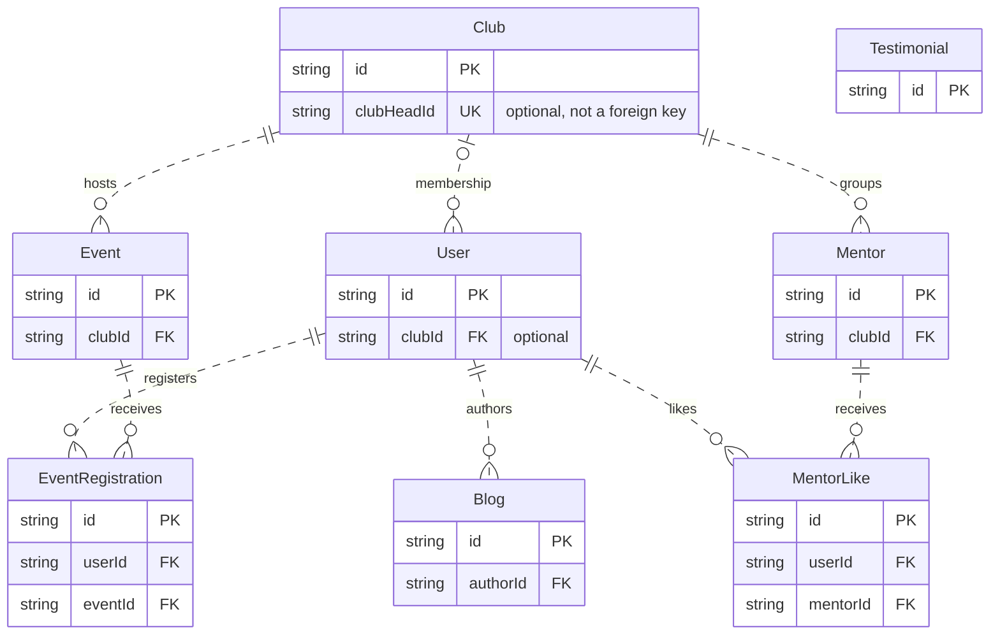

Prisma models the backend's PostgreSQL data in `backend/prisma/schema.prisma`. The eight models describe accounts, clubs, events and registrations, mentors and likes, blogs, and testimonials. Controllers query these models directly; the relationships and constraints below shape what those controllers can persist.

## Persisted entities

| Model | Domain role |
| --- | --- |
| `User` | Account identity, password/Google profile, role, and optional club membership. |
| `Club` | Community club with members, events, mentors, and a separately stored leadership identifier. |
| `Event` | Scheduled event belonging to one club. |
| `EventRegistration` | A user's registration for one event, with a registration timestamp. |
| `Mentor` | Mentor profile belonging to one club; it is not linked to a user account. |
| `MentorLike` | A user's like for one mentor. |
| `Blog` | Authored content with `DRAFT`, `PUBLISHED`, or `ARCHIVED` status; new records default to `DRAFT`. |
| `Testimonial` | Standalone name, batch year, content, and optional image; no user or club relation. |

All models have string primary identifiers generated by Prisma's `cuid()` default. `@@map` maps them to PostgreSQL tables such as `users`, `event_registrations`, and `mentor_likes`; the SQL migrations define their text primary-key columns without a database-side CUID default.

## Relationships

A user belongs to zero or one club through nullable `User.clubId`; a club can have many users. Every event and mentor requires one club. Every blog requires one author. Registrations and likes are join records with their own identifiers: each requires one user and one event or mentor, respectively. Parents can have zero related records.

The diagram deliberately has no leadership edge for `Club.clubHeadId`: it is a unique scalar, not a Prisma relation or SQL foreign key. The pair constraints on registrations and likes are described below, rather than drawn as single-column uniqueness.

<SourceReference href="https://github.com/vaibhavxtripathi/ElixirV4/blob/main/backend/prisma/schema.prisma">backend/prisma/schema.prisma</SourceReference>

## Constraints that affect behavior

User email and a non-null Google subject (`googleId`) are unique. Google controllers locate users by email, and the unique subject prevents assigning the same non-null Google identifier to multiple accounts. Club names and non-null `clubHeadId` values are also unique. Nullable unique columns can contain multiple null values in PostgreSQL.

`EventRegistration` has a compound unique constraint on `(userId, eventId)`, so the database permits at most one registration per user/event pair. `MentorLike` has the equivalent constraint on `(userId, mentorId)`. Controller lookups check these pairs, but the database constraint remains the final boundary if concurrent requests attempt duplicates.

Foreign keys enforce the existence of referenced clubs, users, events, and mentors. Required relationships cannot be set to null. A mentor's identity is independent of `User`; sharing a name does not create an account relationship. Testimonials likewise store their attribution directly, without a relational link to an account.

`User.role` and `Blog.status` are persisted PostgreSQL enums. Their permitted values are database constraints, but rules about who may change them are implemented in routes/controllers. See [Authentication & Authorization](./authentication-authorization.mdx).

<SourceReference href="https://github.com/vaibhavxtripathi/ElixirV4/blob/main/backend/prisma/migrations/20250829203812_initial_migration/migration.sql">backend/prisma/migrations/20250829203812_initial_migration/migration.sql</SourceReference>
<SourceReference href="https://github.com/vaibhavxtripathi/ElixirV4/blob/main/backend/prisma/migrations/20251017102352_add_google_oauth_fields/migration.sql">backend/prisma/migrations/20251017102352_add_google_oauth_fields/migration.sql</SourceReference>
<SourceReference href="https://github.com/vaibhavxtripathi/ElixirV4/blob/main/backend/prisma/migrations/20251025152715_add_mentor_likes/migration.sql">backend/prisma/migrations/20251025152715_add_mentor_likes/migration.sql</SourceReference>

## Deletion behavior

The checked-in SQL migrations establish these foreign-key actions. Later migrations do not replace them.

| Deleted parent | Database behavior for related records |
| --- | --- |
| `Club` | Sets members' `User.clubId` to null; events and mentors referencing the club restrict deletion. |
| `User` | Event registrations and authored blogs restrict deletion; mentor likes cascade. |
| `Event` | Registrations restrict deletion. |
| `Mentor` | Mentor likes cascade. |

`RESTRICT` prevents deletion while referencing rows remain. `SET NULL` preserves the child with its optional relationship cleared. `CASCADE` deletes the related rows when the parent is deleted successfully. All these foreign keys use `ON UPDATE CASCADE` for referenced identifiers.

The event-deletion controller explicitly removes registrations before deleting the event. These are separate awaited statements, not a transaction or a database cascade. The mentor-deletion controller deletes the mentor directly and relies on the like foreign key's cascade.

<TechnicalDebt>
The user-deletion controller comments that related records cascade, but its actual operation is a direct user delete. Registrations and blogs have restrictive foreign keys, so a user with either cannot be deleted this way; the controller catches the failure and returns HTTP 500. Contributors must use the migration rules when reasoning about deletion, not that comment.
</TechnicalDebt>

`Club.clubHeadId` has no foreign key, so deleting a user does not clear that scalar or prevent deletion on its own. Other restrictive relations may still block the user deletion.

<SourceReference href="https://github.com/vaibhavxtripathi/ElixirV4/blob/main/backend/prisma/migrations/20250901211052_add_blogs/migration.sql">backend/prisma/migrations/20250901211052_add_blogs/migration.sql</SourceReference>
<SourceReference href="https://github.com/vaibhavxtripathi/ElixirV4/blob/main/backend/src/controllers/userController.ts">backend/src/controllers/userController.ts</SourceReference>
<SourceReference href="https://github.com/vaibhavxtripathi/ElixirV4/blob/main/backend/src/controllers/eventController.ts">backend/src/controllers/eventController.ts</SourceReference>

## Club leadership and membership

Three independent pieces of state participate in club access:

| State | What is enforced |
| --- | --- |
| `User.role` | Must be one of the role enum values; it does not imply club membership. |
| `User.clubId` | Optional foreign key to an existing club; at most one club per user. |
| `Club.clubHeadId` | Optional unique string; no foreign key to `User` and no role/membership constraint. |

Club creation looks up a user by `clubHeadEmail`, creates a club with that user's ID as `clubHeadId`, then updates the user's role to `CLUB_HEAD` and membership to the new club. These writes are not in a transaction. Separately, user administration can change a role or assign, remove, or update membership without updating the club's leadership scalar.

<TechnicalDebt>
Leadership, role, and membership are application-managed fields rather than one database-enforced invariant. Separate writes and independent administrative changes can leave them inconsistent. Event ownership checks consult the user's current club, so contributors cannot use `clubHeadId` alone to predict who passes those checks.
</TechnicalDebt>

<SourceReference href="https://github.com/vaibhavxtripathi/ElixirV4/blob/main/backend/src/controllers/clubController.ts">backend/src/controllers/clubController.ts</SourceReference>

## Migrations

Six checked-in Prisma migrations evolve the initial accounts/clubs/events/mentors schema with blogs, testimonials, mentor LinkedIn URLs, Google identity fields, and mentor likes. `migration_lock.toml` identifies PostgreSQL as the provider. The schema describes the current generated client model; migration SQL records the database changes, including deletion actions and unique indexes.

The backend's `db:migrate` script runs `prisma migrate dev`. Deployment does not automatically follow from the presence of migrations; see [Deployment & Configuration](./deployment-configuration.mdx#build-and-start). The [Change the Database Schema guide](../guides/change-the-database-schema.mdx) is reserved for a later phase.

<SourceReference href="https://github.com/vaibhavxtripathi/ElixirV4/tree/main/backend/prisma/migrations">backend/prisma/migrations/</SourceReference>
