Blogs store an author, content, and one of three statuses: `DRAFT`, `PUBLISHED`, or `ARCHIVED`. Contributor submission always creates a draft; administrative operations can publish, archive, edit, or delete records. Status controls public visibility, but the backend does not enforce a strict sequence of moderation transitions.

## Submission and authorship

The submission route accepts `STUDENT`, `CLUB_HEAD`, and `ADMIN` tokens. It takes the author identifier from the token and explicitly writes `DRAFT`, regardless of a caller-supplied status. The author can list all their own blogs and read their unpublished detail with a verified token.

There is no contributor editing, deletion, withdrawal, or resubmission route. An author being allowed to read a draft does not grant access to the admin update route. Request fields and response shapes are in [Blogs API](../api-reference/blogs.mdx).

## Stored statuses and moderation

| Status | Current visibility |
| --- | --- |
| `DRAFT` | Excluded from the public list; detail available to the author or an admin with a verified bearer token. |
| `PUBLISHED` | Included in the public list; detail is public. |
| `ARCHIVED` | Excluded from the public list; detail remains available to the author or an admin. |

Approval writes `PUBLISHED`; archiving writes `ARCHIVED`. Neither controller checks the prior status. An archived blog can be approved again, and a draft can be archived directly. Admin update can set any of the three enum values, including moving a published or archived blog to draft. Repeating approval or archiving is not rejected because the record is already in that state.

```mermaid
stateDiagram-v2
    accTitle: Blog statuses and moderation writes
    accDescr: Submission creates a draft; admin approval, archiving, or update can change stored status. Only published records are public.
    DRAFT: DRAFT (author/admin detail)
    PUBLISHED: PUBLISHED (public)
    ARCHIVED: ARCHIVED (author/admin detail)
    [*] --> DRAFT: Contributor submission
    DRAFT --> PUBLISHED: Admin approve
    ARCHIVED --> PUBLISHED: Admin approve
    DRAFT --> ARCHIVED: Admin archive
    PUBLISHED --> ARCHIVED: Admin archive
    PUBLISHED --> DRAFT: Admin update
    ARCHIVED --> DRAFT: Admin update
```

The arrows show available status-changing operations, not transition guards. Admin update can also perform the transitions labeled approve/archive, and same-status writes are omitted. The initial arrow represents contributor submission: admin creation may instead start at any supplied valid status, defaulting to `DRAFT`.

## Visibility is enforced by each read route

The public listing selects only `PUBLISHED` records. The detail controller first loads the record: missing records return not found, published records return without authentication, and other statuses require a verified bearer token belonging to the author or an admin. Missing/invalid credentials on unpublished detail produce a forbidden response, rather than the shared middleware's unauthorized response.

The personal listing filters by the token's author identifier and includes every status. The admin listing returns all blogs and statuses. None of these listings implements pagination. Public listing and detail return the stored content string, not merely a summary.

The role and author checks use JWT claims; they do not globally reload the account's current role. See [Authentication & Authorization](../architecture/authentication-authorization.mdx#jwt-identity) for that boundary.

## Administrative control

Admins can create a blog under their own token identity, edit any blog's title/content/image/status, publish, archive, and delete. Update does not accept an author-change field in its controller. Deletion removes the record rather than assigning `ARCHIVED`; archiving preserves it for authorized reads.

The model stores no moderation history, approval actor, rejection reason, or status-transition audit record. `updatedAt` tracks model updates, not a full review history. Contributors should not infer those features from the moderation route names.

<SourceReference href="https://github.com/vaibhavxtripathi/ElixirV4/blob/main/backend/src/routes/blogs.ts">backend/src/routes/blogs.ts</SourceReference>
<SourceReference href="https://github.com/vaibhavxtripathi/ElixirV4/blob/main/backend/src/controllers/blogController.ts">backend/src/controllers/blogController.ts</SourceReference>
<SourceReference href="https://github.com/vaibhavxtripathi/ElixirV4/blob/main/backend/prisma/schema.prisma">backend/prisma/schema.prisma</SourceReference>
